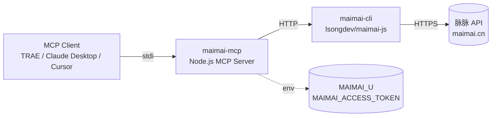

# maimai-mcp

[](https://opensource.org/licenses/MIT)
[](https://nodejs.org/)
[](https://github.com/JACKWang19559/maimai-mcp)
[](https://modelcontextprotocol.io/)
[](https://github.com/JACKWang19559/maimai-mcp/pulls)

> [English](./README_EN.md) | 中文

[Model Context Protocol](https://modelcontextprotocol.io/) Server wrapping [maimai-cli](https://github.com/lsongdev/maimai-js)，让 AI Agent（如 TRAE、Claude Desktop、Cursor）能通过统一协议调用脉脉的招聘功能 —— 获取联系人、推荐人才、对话历史、向候选人发消息等。

## 架构



## 暴露工具

| 工具名 | 类型 | 说明 |
|---|---|---|
| [`maimai_get_contacts`](#1-maimai_get_contacts) | 只读 | 获取脉脉联系人列表 |
| [`maimai_recommend_talents`](#2-maimai_recommend_talents) | 只读 | 根据职位 ID 获取推荐人才 |
| [`maimai_get_dialog`](#3-maimai_get_dialog) | 只读 | 获取与指定联系人的对话历史 |
| [`maimai_recruiter_send`](#4-maimai_recruiter_send) | 写操作 | 招聘立即沟通，向候选人发消息 |
| [`maimai_enterprise_send`](#5-maimai_enterprise_send) | 写操作 | 企业极速联系候选人 |

## 工具详情

### 1. `maimai_get_contacts`

获取脉脉联系人（好友）列表。

**参数**

| 参数 | 类型 | 必填 | 默认 | 说明 |
|---|---|---|---|---|
| `paginate` | number | 否 | 0 | 分页标识，0 表示首页 |

**调用示例**

```json
{
  "name": "maimai_get_contacts",
  "arguments": { "paginate": 0 }
}
```

**返回示例（截断）**

```json
{
  "contacts": [
    { "id": "12345", "name": "张三", "company": "字节跳动", "position": "算法工程师" }
  ],
  "has_more": true,
  "next_paginate": 1690000000000
}
```

### 2. `maimai_recommend_talents`

根据已发布职位 ID 获取脉脉推荐人才列表（招聘方功能，需招聘方账号权限）。

**参数**

| 参数 | 类型 | 必填 | 默认 | 说明 |
|---|---|---|---|---|
| `jid` | string | 是 | - | 脉脉职位 ID（在脉脉招聘后台获取） |
| `page` | number | 否 | 1 | 页码 |

**调用示例**

```json
{
  "name": "maimai_recommend_talents",
  "arguments": { "jid": "job_abc123", "page": 1 }
}
```

### 3. `maimai_get_dialog`

获取与指定联系人的对话消息历史。

**参数**

| 参数 | 类型 | 必填 | 默认 | 说明 |
|---|---|---|---|---|
| `mid` | string | 是 | - | 对方用户 ID |
| `count` | number | 否 | 10 | 拉取消息条数 |

**调用示例**

```json
{
  "name": "maimai_get_dialog",
  "arguments": { "mid": "12345", "count": 20 }
}
```

### 4. `maimai_recruiter_send`

招聘立即沟通：以招聘方身份向候选人发送消息。**调用前会在 stderr 打印审计日志**。需招聘方账号权限。

**参数**

| 参数 | 类型 | 必填 | 默认 | 说明 |
|---|---|---|---|---|
| `uid` | string | 是 | - | 候选人脉脉用户 ID |
| `content` | string | 是 | - | 要发送的消息内容 |

**调用示例**

```json
{
  "name": "maimai_recruiter_send",
  "arguments": { "uid": "12345", "content": "您好，看到您的经历很匹配我们的岗位，方便聊聊吗？" }
}
```

**审计日志（stderr）**

```
[maimai-mcp][审计] recruiter_send -> uid=12345, content=您好...
```

### 5. `maimai_enterprise_send`

企业极速联系候选人。**调用前会在 stderr 打印审计日志**。需企业招聘方账号权限。

**参数**

| 参数 | 类型 | 必填 | 默认 | 说明 |
|---|---|---|---|---|
| `to_uids` | string | 是 | - | 目标用户 ID |
| `content` | string | 是 | - | 要发送的消息内容 |
| `jid` | string | 否 | "" | 关联职位 ID |

**调用示例**

```json
{
  "name": "maimai_enterprise_send",
  "arguments": { "to_uids": "12345", "content": "极速联系测试", "jid": "job_abc123" }
}
```

## 安装

```bash
git clone https://github.com/JACKWang19559/maimai-mcp.git
cd maimai-mcp
npm install
```

## 获取脉脉认证信息

1. 浏览器登录 https://maimai.cn/
2. F12 打开开发者工具 → Application → Cookies → `https://maimai.cn`
3. 复制两个 cookie 值：
   - `u` → 作为 `MAIMAI_U`
   - `access_token` → 作为 `MAIMAI_ACCESS_TOKEN`

⚠️ **access_token 是敏感凭据，不要提交到 git 或公开分享。** Token 通常 60 天过期，失效后重新登录获取。

## MCP 配置

将以下配置添加到你的 MCP 客户端的 `mcpServers` 配置中（Claude Desktop 的 `claude_desktop_config.json` / TRAE MCP 配置 / Cursor 等）：

```json
{
  "mcpServers": {
    "maimai": {
      "command": "node",
      "args": [
        "/absolute/path/to/maimai-mcp/index.js"
      ],
      "env": {
        "MAIMAI_U": "你的脉脉用户ID",
        "MAIMAI_ACCESS_TOKEN": "你的脉脉access_token"
      }
    }
  }
}
```

### 环境变量

| 变量 | 必填 | 说明 |
|---|---|---|
| `MAIMAI_U` | 是 | 脉脉用户 ID（cookie 中的 `u`） |
| `MAIMAI_ACCESS_TOKEN` | 是 | 脉脉 access token（cookie 中的 `access_token`） |
| `MAIMAI_CLI_PATH` | 否 | 自定义 maimai-cli 目录路径 |

> 默认 `MAIMAI_CLI_PATH` 指向 `.trae-cn/mcps/recruitment_tools/maimai-cli`。如果使用独立部署，请将 [maimai-cli](https://github.com/lsongdev/maimai-js) 克隆到任意位置，并通过此变量指定。

## 安全审计

写操作（`maimai_recruiter_send` / `maimai_enterprise_send`）调用前会在 stderr 打印审计日志：

```
[maimai-mcp][审计] recruiter_send -> uid=12345, content=您好...
[maimai-mcp][审计] enterprise_send -> to_uids=12345, content=极速联系...
```

便于在 MCP 客户端的日志面板追踪 AI 的发消息行为。

## 开发指南

### 本地开发

```bash
git clone https://github.com/JACKWang19559/maimai-mcp.git
cd maimai-mcp
npm install
# 修改 index.js 后用 stdio 调试
node index.js
```

### 添加新工具

1. 在 `index.js` 的 `TOOLS` 数组中添加新对象，包含 `name`、`description`、`inputSchema`、`handler`
2. `handler` 中通过 `getChatClient()` 或 `getEnterpriseClient()` 获取客户端实例
3. 重新启动 MCP server 即可生效

### 测试

MCP server 通过 stdio 通信，推荐使用 [MCP Inspector](https://github.com/modelcontextprotocol/inspector) 调试：

```bash
npx @modelcontextprotocol/inspector node index.js
```

## FAQ

**Q: access_token 过期怎么办？**
A: 重新登录脉脉网页版，从 cookie 重新获取 `u` 和 `access_token`，更新 MCP 配置中的环境变量后重启 MCP 客户端。

**Q: 启动报错 `maimai-cli 未找到`？**
A: 默认路径是 TRAE 部署路径。独立部署时请先 `git clone https://github.com/lsongdev/maimai-js.git maimai-cli`，然后设置 `MAIMAI_CLI_PATH` 环境变量指向 `maimai-cli` 目录。

**Q: 报错 `MAIMAI_U 或 MAIMAI_ACCESS_TOKEN 缺失`？**
A: 检查 MCP 配置的 `env` 字段是否正确填写，且两个变量都未空。

**Q: 能否用于商业用途？**
A: 本项目基于 MIT 协议开源，可商用。但使用脉脉 API 时请遵守脉脉的用户协议和相关法律法规。写操作（发消息）有频控风险，请合理使用。

**Q: 是否支持企业账号批量操作？**
A: 当前版本仅支持单条消息发送。批量操作请基于 `maimai_enterprise_send` 自行扩展，并注意脉脉的频控策略。

## 贡献指南

欢迎提交 Issue 和 PR！

1. Fork 本仓库
2. 创建特性分支：`git checkout -b feature/your-feature`
3. 提交更改：`git commit -m 'feat: add your feature'`
4. 推送分支：`git push origin feature/your-feature`
5. 提交 Pull Request

请确保代码风格一致，新增工具需在 README 中补充说明。

## 相关项目

- [maimai-cli (maimai-js)](https://github.com/lsongdev/maimai-js) —— 本项目依赖的脉脉 JavaScript API
- [Model Context Protocol](https://modelcontextprotocol.io/) —— MCP 协议官方规范
- [MCP Inspector](https://github.com/modelcontextprotocol/inspector) —— MCP server 调试工具
- [Awesome MCP Servers](https://github.com/modelcontextprotocol/servers) —— MCP 服务器集合

## License

[MIT](./LICENSE) © 2026 [JACKWang19559](https://github.com/JACKWang19559)
