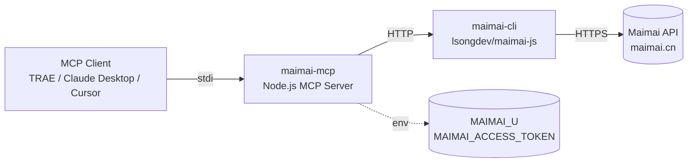

# maimai-mcp

[](https://opensource.org/licenses/MIT)
[](https://nodejs.org/)
[](https://github.com/JACKWang19559/maimai-mcp)
[](https://modelcontextprotocol.io/)
[](https://github.com/JACKWang19559/maimai-mcp/pulls)

> English | [中文](./README.md)

A [Model Context Protocol](https://modelcontextprotocol.io/) Server wrapping [maimai-cli](https://github.com/lsongdev/maimai-js), enabling AI Agents (TRAE, Claude Desktop, Cursor, etc.) to invoke Maimai (脉脉) recruitment features via a unified protocol — contacts, recommended talents, dialog history, and sending messages to candidates.

## Architecture



## Exposed Tools

| Tool | Type | Description |
|---|---|---|
| `maimai_get_contacts` | Read | Get Maimai contacts list |
| `maimai_recommend_talents` | Read | Get recommended talents by job ID |
| `maimai_get_dialog` | Read | Get dialog history with a contact |
| `maimai_recruiter_send` | Write | Recruiter instant message to candidate |
| `maimai_enterprise_send` | Write | Enterprise fast-contact candidate |

## Installation

```bash
git clone https://github.com/JACKWang19559/maimai-mcp.git
cd maimai-mcp
npm install
```

## Getting Maimai Credentials

1. Log in to https://maimai.cn/ in your browser
2. Open DevTools (F12) → Application → Cookies → `https://maimai.cn`
3. Copy two cookie values:
   - `u` → use as `MAIMAI_U`
   - `access_token` → use as `MAIMAI_ACCESS_TOKEN`

⚠️ **access_token is a sensitive credential. Do NOT commit to git or share publicly.** Token typically expires in 60 days.

## MCP Configuration

Add the following to your MCP client's `mcpServers` config (Claude Desktop's `claude_desktop_config.json` / TRAE / Cursor, etc.):

```json
{
  "mcpServers": {
    "maimai": {
      "command": "node",
      "args": [
        "/absolute/path/to/maimai-mcp/index.js"
      ],
      "env": {
        "MAIMAI_U": "your-maimai-user-id",
        "MAIMAI_ACCESS_TOKEN": "your-maimai-access-token"
      }
    }
  }
}
```

### Environment Variables

| Variable | Required | Description |
|---|---|---|
| `MAIMAI_U` | Yes | Maimai user ID (cookie `u`) |
| `MAIMAI_ACCESS_TOKEN` | Yes | Maimai access token (cookie `access_token`) |
| `MAIMAI_CLI_PATH` | No | Custom path to maimai-cli directory |

> By default, `MAIMAI_CLI_PATH` points to `.trae-cn/mcps/recruitment_tools/maimai-cli`. For standalone deployment, clone [maimai-cli](https://github.com/lsongdev/maimai-js) to any location and set this variable.

## Tool Details

### 1. `maimai_get_contacts`

Get Maimai contacts (friends) list.

**Parameters**

| Param | Type | Required | Default | Description |
|---|---|---|---|---|
| `paginate` | number | No | 0 | Pagination cursor, 0 for first page |

**Example**

```json
{ "name": "maimai_get_contacts", "arguments": { "paginate": 0 } }
```

### 2. `maimai_recommend_talents`

Get recommended talents for a published job (recruiter-only).

**Parameters**

| Param | Type | Required | Default | Description |
|---|---|---|---|---|
| `jid` | string | Yes | - | Maimai job ID |
| `page` | number | No | 1 | Page number |

**Example**

```json
{ "name": "maimai_recommend_talents", "arguments": { "jid": "job_abc123" } }
```

### 3. `maimai_get_dialog`

Get dialog message history with a contact.

**Parameters**

| Param | Type | Required | Default | Description |
|---|---|---|---|---|
| `mid` | string | Yes | - | Contact user ID |
| `count` | number | No | 10 | Number of messages |

**Example**

```json
{ "name": "maimai_get_dialog", "arguments": { "mid": "12345", "count": 20 } }
```

### 4. `maimai_recruiter_send`

Recruiter instant message to candidate. **Audit log printed to stderr before call.** Recruiter permission required.

**Parameters**

| Param | Type | Required | Default | Description |
|---|---|---|---|---|
| `uid` | string | Yes | - | Candidate user ID |
| `content` | string | Yes | - | Message content |

**Example**

```json
{ "name": "maimai_recruiter_send", "arguments": { "uid": "12345", "content": "Hi, your profile matches our role." } }
```

### 5. `maimai_enterprise_send`

Enterprise fast-contact candidate. **Audit log printed to stderr before call.**

**Parameters**

| Param | Type | Required | Default | Description |
|---|---|---|---|---|
| `to_uids` | string | Yes | - | Target user ID |
| `content` | string | Yes | - | Message content |
| `jid` | string | No | "" | Associated job ID |

**Example**

```json
{ "name": "maimai_enterprise_send", "arguments": { "to_uids": "12345", "content": "Hello!" } }
```

## Security Audit

Write operations print audit logs to stderr before execution:

```
[maimai-mcp][audit] recruiter_send -> uid=12345, content=Hi...
[maimai-mcp][audit] enterprise_send -> to_uids=12345, content=Hello...
```

Track AI messaging behavior in your MCP client's log panel.

## Development

### Local Dev

```bash
git clone https://github.com/JACKWang19559/maimai-mcp.git
cd maimai-mcp
npm install
node index.js  # stdio debug
```

### Adding New Tools

1. Add a new object to the `TOOLS` array in `index.js` with `name`, `description`, `inputSchema`, `handler`
2. Use `getChatClient()` or `getEnterpriseClient()` in the handler
3. Restart the MCP server

### Testing

Use [MCP Inspector](https://github.com/modelcontextprotocol/inspector) for debugging:

```bash
npx @modelcontextprotocol/inspector node index.js
```

## FAQ

**Q: What if access_token expires?**
A: Log in to maimai.cn again, fetch fresh `u` and `access_token` from cookies, update env vars in MCP config, restart MCP client.

**Q: Error `maimai-cli not found`?**
A: Default path is TRAE-specific. For standalone setup, `git clone https://github.com/lsongdev/maimai-js.git maimai-cli`, then set `MAIMAI_CLI_PATH` to the `maimai-cli` directory.

**Q: Error `MAIMAI_U or MAIMAI_ACCESS_TOKEN missing`?**
A: Check the `env` field in MCP config — both vars must be non-empty.

**Q: Commercial use?**
A: MIT licensed, commercial use allowed. But comply with Maimai's ToS and local laws when using their API. Write operations may trigger rate limits — use responsibly.

## Contributing

Issues and PRs welcome!

1. Fork this repo
2. Create feature branch: `git checkout -b feature/your-feature`
3. Commit: `git commit -m 'feat: add your feature'`
4. Push: `git push origin feature/your-feature`
5. Open a Pull Request

## Related Projects

- [maimai-cli (maimai-js)](https://github.com/lsongdev/maimai-js) — underlying Maimai JS API
- [Model Context Protocol](https://modelcontextprotocol.io/) — MCP spec
- [MCP Inspector](https://github.com/modelcontextprotocol/inspector) — debugging tool
- [Awesome MCP Servers](https://github.com/modelcontextprotocol/servers) — curated MCP servers

## License

[MIT](./LICENSE) © 2026 [JACKWang19559](https://github.com/JACKWang19559)
